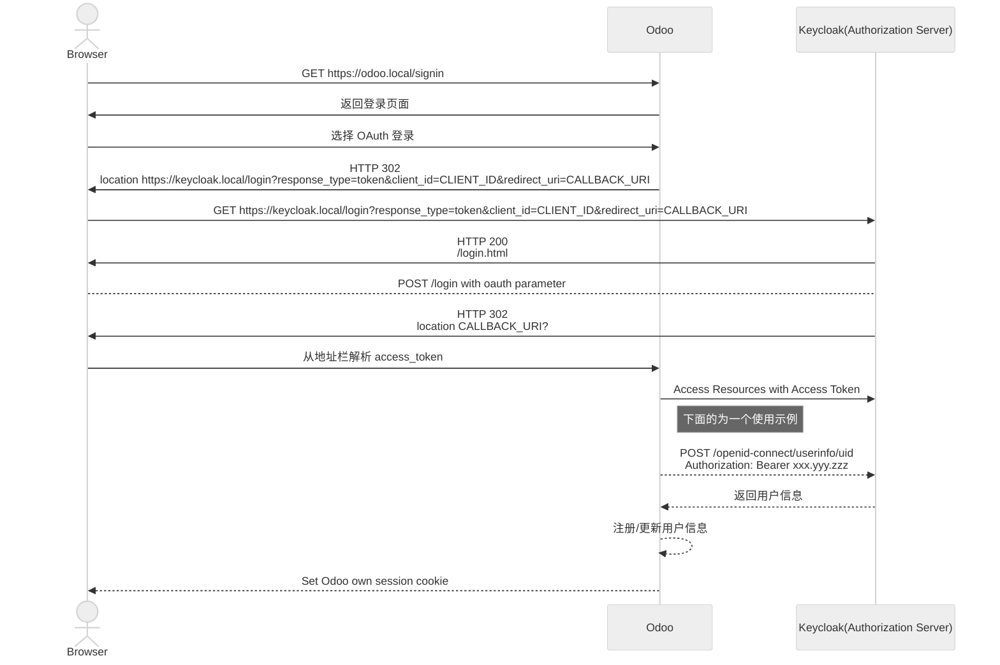

# OAuth 2.0 

> [!abstract] 简介
> OAuth 2.0 是一套授权框架协议，用来支持第三方程序获取对 HTTP 服务的访问权限。

## 核心角色

OAuth 2.0 协议中定义了以下角色：

- **资源所有者** (resource owner): 简单理解就是我们终端用户
- **资源服务器** (resource server): 终端用户的资源服务器
- **客户端** (client): 代表资源所有者发起请求的应用
- **授权服务器**(authorization server): 在资源所有者进行鉴权之后，颁发令牌的服务器

>[!info] 
> - resource server 与 authorization server 有可能是一个服务，也有可能分属不同服务
> - client 的角色不是常规意义上的 client ，可以是一个 SPA 应用，一个 APP ，一个网页 ，或者一个 Server 都可以作为 client 角色参与在 OAuth 的流程中

## 主体流程



客户端作为一个接入方，首先获取用户的授权，拿到用户授权以后，在向授权服务器请求获取 access token ，拿到 token 以后，我们就能正常获取资源服务器中被授权的内容了

## 授权模式

### **授权码模式 (Authorization Code)**

> [!info] OAuth 授权码
> 授权码流程会通过 `/authorization` 获取申请授权，获取授权码，从 `/token` 端点通过授权码获取 交换为**访问令牌(access_token)** 之后通过访问令牌进行交互。
> 可能具体的平台上针对不同的应用类型，会有一些变体流程，但是核心流程思路不变

#### OAuth 流程



- A: Client 通过将浏览器的请求发送到 Authorization Server 来发起流程，请求中包括了授权码申请的请求参数
- B: Authorization Server 进行身份验证
- C: 授权通过以后，会返回 Authorization code 
- D: Client 带着授权码以及重定向 URI 获取 token
- E：Authorization Server校验通过以后,会返回 AccessToken

#### 参数说明

##### Authorization Request

| 参数名称          | 类型          | 示例                                                                     | 说明                                                               |
| ------------- | ----------- | ---------------------------------------------------------------------- | ---------------------------------------------------------------- |
| response_type | REQUIRED    | token                                                                  | 固定值 'token'                                                      |
| client_id     | REQUIRED    | odoo                                                                   | 在 OAuth Provider 中的 client 标识                                    |
| redirect_uri  | OPTIONAL    | http://odoo.local:8069/auth_oauth/signin                               | OAuth Provider 完成 OAuth 重定向的目标端点                                 |
| scope         | OPTIONAL    | openid email profile                                                   | 用来在客户端与服务端标识 Token 的请求的权限范围,通常是以空格分隔                             |
| state         | RECOMMENDED | {"d": "odoo", "p": 4, "r": "http%3A%2F%2Fodoo.local%3A8069%2Fodoo%3F"} | 由客户端提供的一个不透明信息，在 OAuth Server 响应的时会返回给 Client，客户端用来校验以防止 CSRF 攻击 |

##### Authorization Response

| 参数名称  | 类型       | 示例         | 说明                                   |
| ----- | -------- | ---------- | ------------------------------------ |
| code  | REQUIRED | samplecode | 授权服务器生成的授权码，授权码的过期时间应该非常端            |
| state | REQUIRED | anything   | 如果客户端授权请求中存在 “state” 参数，则为 REQUIRED。 |
##### Access Token Request

| 参数名称         | 类型       | 示例                 | 说明                          |
| ------------ | -------- | ------------------ | --------------------------- |
| grant_type   | REQUIRED | authorization_code | 固定值 `authorization_code`    |
| code         | REQUIRED | samplecode         | 从授权服务器接收的授权码                |
| redirect_uri | REQUIRED |                    | 如果授权请求中包含，则必传且值必须相同         |
| client_id    | REQUIRED | odoo               | 如果client 没有进行授权验证，client 必传 |

##### Access Token Response

Access Token Response 通常是以 `json` 格式进行返回

| 参数名称          | 类型                | 示例                   | 说明                                       |
| ------------- | ----------------- | -------------------- | ---------------------------------------- |
| access_token  | REQUIRED          | sample_token         | 授权服务的授权 token                            |
| token_type    | REQUIRED          | Bearer               |                                          |
| expires_in    | RECOMMENDED       | 3600                 | token 剩余的过期时间                            |
| refresh_token | OPTIONAL          | sample_refresh_token | 刷新令牌，在刷新令牌流程用此 token 中来获取新的 assess_token |
| scope         | OPTIONAL/REQUIRED | openid email profile | 如果与 Client 端请求的 scope 相同;否则为 REQUIRED    |
|               |                   |                      |                                          |


> [!example] 通过响应头禁用客户端缓存
> ```text
> HTTP/1.1 200 OK
>     Content-Type: application/json;charset=UTF-8
>     Cache-Control: no-store
>     Pragma: no-cache
>
>    {
>       "access_token":"2YotnFZFEjr1zCsicMWpAA",
>       "token_type":"example",
>       "expires_in":3600,
>       "refresh_token":"tGzv3JOkF0XG5Qx2TlKWIA",
>       "example_parameter":"example_value"
>    }
> ```


###### token_type 说明

- **Bearer** 类型的 Token 可以直接请求资源

> [!example]
> ```
> GET /resource/1 HTTP/1.1
> Host: example.com
> Authorization: Bearer mF_9.B5f-4.1JqM
> ```

- **mac** 类型需要在颁发访问令牌的同时提供一个消息认证码（MAC）密钥，用于对 HTTP 请求的某些部分进行签名

> [!example]
> ```
> GET /resource/1 HTTP/1.1
> Host: example.com
> Authorization: MAC id="h480djs93hd8",
>                  nonce="274312:dj83hs9s",
>                  mac="kDZvddkndxvhGRXZhvuDjEWhGeE="
> ```


### 隐式授权模式(Implicit Grant)

> [!info] Oauth 隐式授权
> 隐式授权的特征是令牌（ID 令牌或访问令牌）直接从 `/authorize` 端点返回，而不是从 `/token` 端点返回。

> [!danger]
>  隐式授权适用于无需后端存储凭证的早期 SPA 或传统 Web 登录场景，但存在令牌泄露等安全风险，如果作为新接入，不要考虑此种方式接入，优先使用 Authorization Code + PKCE流程。

#### 授权流程 



#### 参数说明

由于简化了交互流程，所以在 `/authorize` 端点就会返回 token ，所以请求字段没有变化，返回字段也基本没有大的改变，知识返回方式有一些变化

##### Authorization Request

| 参数名称          | 类型          | 示例                                                                     | 说明                                                               |
| ------------- | ----------- | ---------------------------------------------------------------------- | ---------------------------------------------------------------- |
| response_type | REQUIRED    | token                                                                  | 固定值 'token'                                                      |
| client_id     | REQUIRED    | odoo                                                                   | 在 OAuth Provider 中的 client 标识                                    |
| redirect_uri  | OPTIONAL    | http://odoo.local:8069/auth_oauth/signin                               | OAuth Provider 完成 OAuth 重定向的目标端点                                 |
| scope         | OPTIONAL    | openid email profile                                                   | 用来在客户端与服务端标识 Token 的请求的权限范围,通常是以空格分隔                             |
| state         | RECOMMENDED | {"d": "odoo", "p": 4, "r": "http%3A%2F%2Fodoo.local%3A8069%2Fodoo%3F"} | 由客户端提供的一个不透明信息，在 OAuth Server 响应的时会返回给 Client，客户端用来校验以防止 CSRF 攻击 |
##### Authorization Response

隐式授权存在一些安全隐患，标准的 `Response` 是以 **URL fragment** 形式返回参数既在重定向的地址后面通过`#key1=val1&key2=val2` 的形式返回，在浏览器端，JS 是可是劫持到fragment的内容以获取到 `access_token`

| 参数名称         | 类型          | 示例          | 说明                                       |
| ------------ | ----------- | ----------- | ---------------------------------------- |
| access_token | REQUIRED    | xxx.yyy.zzz | authorization server 授权后提供的 Access Token |
| token_type   | REQUIRED    | Bearer      | Token 类型                                 |
| expires_in   | RECOMMENDED | 900         | Access Token 的过期时间，以**秒**为单位             |

### 密码模式(Password Credentials)

适用场景很少，一般仅信任的客户端使用（如自家 App）。



### 客户端凭证(Client Credentials)

服务端到服务端通信。



# 实践场景说明

最近在研究 Odoo 的自定义 OAuth Provider ,所以就以 Odoo 的登录与交互流程来举例吧

Odoo 可能是为了快速兼容多中 OAuth Provider ，所以他的登录流程是基于 Implicit 模式的，但是不影响我们理解





# Token 与 JWT 

其实 OAuth 协议中对于 access_token 的值没有做限制，理论上来说任何满足要的的字符串**都可以**作为 `access_token` 使用，比如一个 `1`,只要 Authorization Server 能通过鉴权,那么`1` 也可以作为 access_token 使用，但是主流实现(Auth0,Keycloak,Google)，基本都会颁发 JWT 格式的 `access_token`

JWT 的 Token 属于标准的三段式 `xxx(Header).yyy(Playload).zzz(Signature)` 中间以 `.` 分隔，每段都进行了 base64 编码,其中第三段为签名段，验签的时候需要使用。

比如下面的这段 token 

>[!example] 302 重定向地址
> http://odoo.local:8069/auth_oauth/signin#state={"d":+"odoo",+"p":+4,+"r":+"http%3A%2F%2Fodoo.local%3A8069%2Fodoo%3F"}&session_state=08dda9bc-ee6a-4805-b839-00c04acb6bd5&iss=http://keycloak.local:8080/realms/beem&access_token=eyJhbGciOiJSUzI1NiIsInR5cCIgOiAiSldUIiwia2lkIiA6ICJEbFJPZmZUS2ZDZDlQZldLdk8wbzV3RVIwNTIwRThOek9iYi12T01RdzNzIn0.eyJleHAiOjE3NDUzMDI2MjYsImlhdCI6MTc0NTMwMTcyNiwiYXV0aF90aW1lIjoxNzQ1MzAxNzI2LCJqdGkiOiJvbnJ0bmE6NDE5YTcxYjYtYjBlNy00MDc4LTllMmEtOGYwZDQ2NDQ0MDU4IiwiaXNzIjoiaHR0cDovL2tleWNsb2FrLmxvY2FsOjgwODAvcmVhbG1zL2JlZW0iLCJhdWQiOiJhY2NvdW50Iiwic3ViIjoiNzA2NDcwYmItNjc3Yi00MjQ3LTljNzctMTlmNWJiYTRiMDY3IiwidHlwIjoiQmVhcmVyIiwiYXpwIjoib2RvbyIsInNpZCI6IjA4ZGRhOWJjLWVlNmEtNDgwNS1iODM5LTAwYzA0YWNiNmJkNSIsImFjciI6IjEiLCJhbGxvd2VkLW9yaWdpbnMiOlsiaHR0cDovL29kb28ubG9jYWw6ODA2OSJdLCJyZWFsbV9hY2Nlc3MiOnsicm9sZXMiOlsiZGVmYXVsdC1yb2xlcy1iZWVtIiwib2ZmbGluZV9hY2Nlc3MiLCJ1bWFfYXV0aG9yaXphdGlvbiJdfSwicmVzb3VyY2VfYWNjZXNzIjp7ImFjY291bnQiOnsicm9sZXMiOlsibWFuYWdlLWFjY291bnQiLCJtYW5hZ2UtYWNjb3VudC1saW5rcyIsInZpZXctcHJvZmlsZSJdfX0sInNjb3BlIjoib3BlbmlkIHByb2ZpbGUgZW1haWwiLCJlbWFpbF92ZXJpZmllZCI6dHJ1ZSwibmFtZSI6IlpoYW5nIFlhbmciLCJwcmVmZXJyZWRfdXNlcm5hbWUiOiJ6aGFuZ3lhbmciLCJnaXZlbl9uYW1lIjoiWmhhbmciLCJmYW1pbHlfbmFtZSI6IllhbmciLCJlbWFpbCI6InpoYW5neWFuZzkxMTEyMEBvdXRsb29rLmNvbSJ9.fxxdUDPrbxwLgQ7lVDL6nSzFmlOyh2X7uHbCVMOQ7fHL0wWNu6r62qTi0TpVvM3gYBIUQdI4d5JUrW7_snzaZy0L-4vc06wQvAYrwDXGdwzSWdIhTuZ7_JjBtoYF1OMjHJr2pb6jeO9190ru2gw4T6Jm8kF4y0KJtQZMtRO_oEWP_wJ7TU6F_W73r-Cg5P7GCJdm4PmvsMMtFzuz2nDCPUehqZSF7wR7ooydGunBFshpyovvwZ24KV9tlM8PTpFXNqohmMHfnmE612euNbDM5lz40L1DKjxUroW1_pYvsDXnf6T5w49ZyFMvbK9sO5y7JPB0ZD465eVYl9PCdwkSOw&token_type=Bearer&expires_in=900

我们可以对 Header 与 Playload 段进行解码


Header 解码
```json
{
  "alg": "RS256",
  "typ": "JWT",
  "kid": "73AZgfMvbINHxZuQ3yCNix2N9nqHglE6P0C6U7qgUU8"
}
```

Payload 解码
```json
{
  "exp": 1745302626,
  "iat": 1745301726,
  "auth_time": 1745301726,
  "jti": "onrtna:419a71b6-b0e7-4078-9e2a-8f0d46444058",
  "iss": "http://keycloak.local:8080/realms/beem",
  "aud": "account",
  "sub": "706470bb-677b-4247-9c77-19f5bba4b067",
  "typ": "Bearer",
  "azp": "odoo",
  "sid": "08dda9bc-ee6a-4805-b839-00c04acb6bd5",
  "acr": "1",
  "allowed-origins": [
    "http://odoo.local:8069"
  ],
  "realm_access": {
    "roles": [
      "default-roles-beem",
      "offline_access",
      "uma_authorization"
    ]
  },
  "resource_access": {
    "account": {
      "roles": [
        "manage-account",
        "manage-account-links",
        "view-profile"
      ]
    }
  },
  "scope": "openid profile email",
  "email_verified": true,
  "name": "Zhang Yang",
  "preferred_username": "zhangyang",
  "given_name": "Zhang",
  "family_name": "Yang",
  "email": "zhangyang911120@outlook.com"
}
```


# OAuth2.0 与 OIDC

如果要兼容 OIDC 协议，需要在 `access_token` 的基础上，颁发 JWT 格式的 `id_token` 并包含 OIDC 标准的兼容字段


# OAuth 与 SSO

SSO（单点登录）和OAuth 2.0在身份认证和授权方面各有特点，理解它们的区别和联系有助于在实际应用中做出合适的选择。

1. **SSO（单点登录）：**
- **定义**：SSO是一种机制，允许用户在多个应用或系统中只需登录一次，即可访问所有相互信任的应用，无需重复登录。
- **应用场景**：适用于企业内部有多个相互关联的系统，用户需要在不同系统间频繁切换的场景。
- **工作原理**：用户在SSO认证系统中登录后，系统会生成一个全局会话或令牌，用户在访问其他应用时，应用通过验证该会话或令牌来确认用户身份，从而实现免登录访问。
2. **OAuth 2.0：**
- **定义**：OAuth 2.0是一个授权框架，允许第三方应用在用户授权的情况下，访问用户在服务提供商处的特定资源，而无需直接提供用户名和密码。
- **应用场景**：适用于需要授权第三方应用访问用户资源的场景，如使用微信登录其他应用。
- **工作原理**：用户授权第三方应用访问其资源后，授权服务器颁发访问令牌（Access Token）给第三方应用，应用持此令牌访问资源服务器上的用户数据。
**区别与联系：**
- **关注点不同**：SSO关注用户在多个系统间的认证过程，旨在提供无缝的登录体验；OAuth 2.0关注授权过程，旨在安全地授权第三方应用访问用户资源。
- **应用场景不同**：SSO主要用于企业内部系统的整合，解决用户在多个内部应用间的认证问题；OAuth 2.0主要用于第三方应用的授权访问，如社交媒体登录等。

# 参考资料

> [!quote]  参考文档
>  - [rfc6749](https://datatracker.ietf.org/doc/html/rfc6749)
>  - [rfc6819](https://datatracker.ietf.org/doc/rfc6819/)