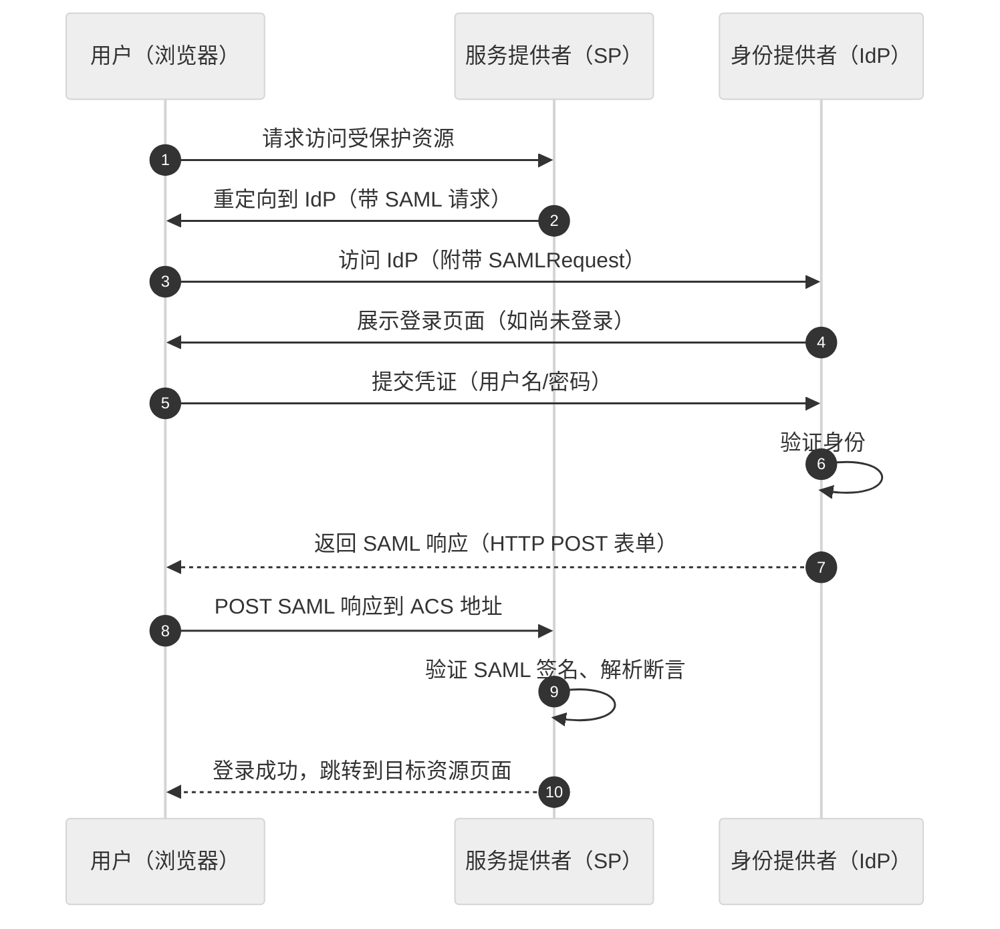
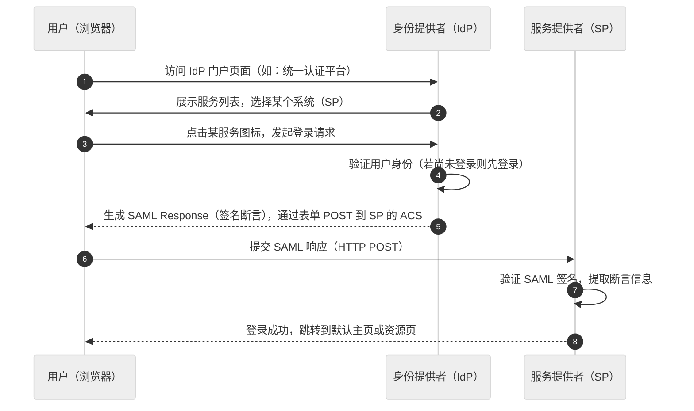
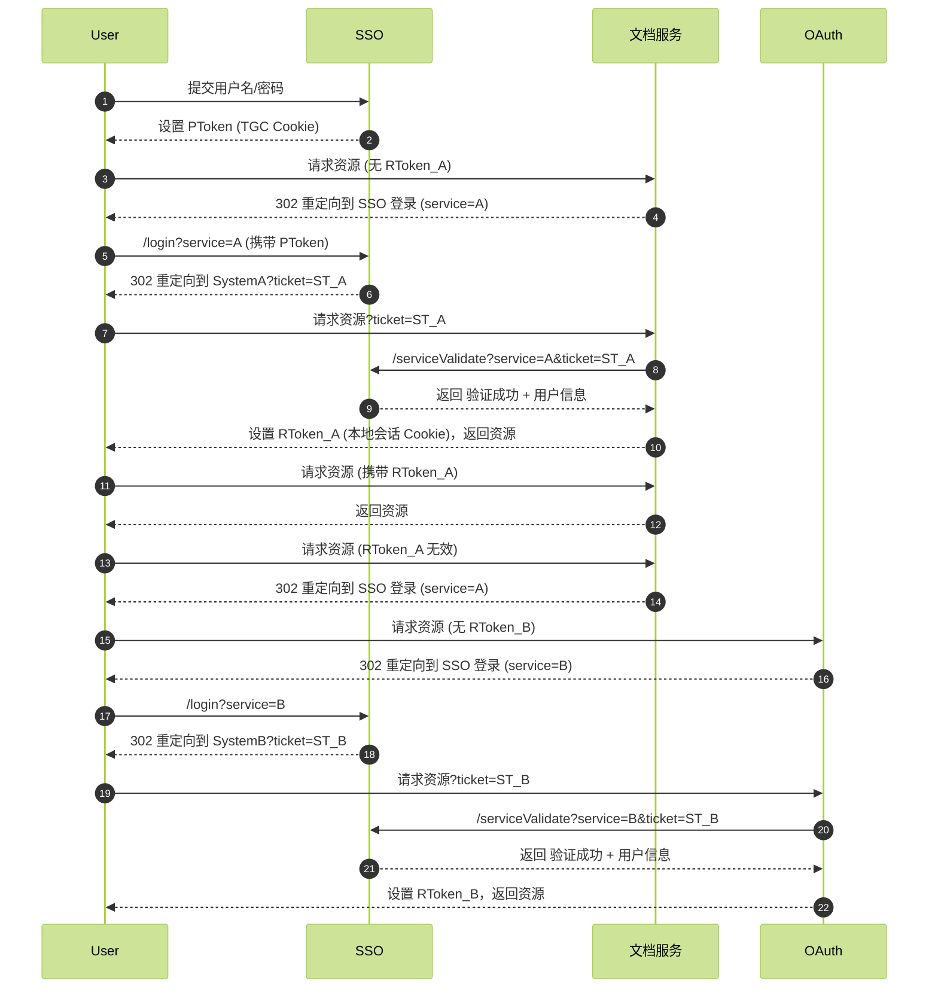

# SAML：企业级跨域单点登录的标准解决方案

在现代企业IT架构中，单点登录（SSO）已成为身份认证的核心需求。SAML（Security Assertion Markup Language）作为企业级SSO的事实标准，通过XML标准实现了跨域的安全身份认证与授权。本文将介绍SAML的工作原理、典型流程，并对比普通SSO流程的差异。

## 什么是SAML？

SAML是一种基于XML的开放联合身份验证标准，它定义了身份提供者（IdP）与服务提供者（SP）之间交换身份和授权信息的协议。SAML的核心价值在于：

- **跨域SSO**：允许用户在一个组织登录后，无需重复认证即可访问其他信任该组织的服务
- **标准化协议**：基于XML的标准化断言格式，确保不同系统间的互操作性
- **安全模型**：通过数字签名和加密保护断言，防止篡改和泄露

## 核心概念：SAML 的三重角色体系

### 1. 身份提供者（IdP）

- **核心职责**：维护用户身份数据库，执行认证流程
- **关键技术**：生成加密签名的 SAML 断言，支持单点登录（SSO）和单点注销（SLO）
- **典型实现**：如 Shibboleth、Microsoft ADFS

### 2. 服务提供者（SP）

- **核心职责**：接收并验证 SAML 断言，实现资源访问控制
- **关键流程**：通过元数据交换与 IdP 建立信任关系，解析断言中的属性信息

### 3. SAML 断言（Assertion）

- **结构组成**：
  - **Issuer**：签发方标识（IdP）
  - **Subject**：用户主体信息
  - **Conditions**：有效期、受众限制等约束条件
  - **Signature**：数字签名确保数据完整性

> [!tip] 断言的生命周期管理是保障安全的关键，建议设置合理的失效时间（`NotOnOrAfter`）字段。


## SAML的典型SSO流程

SAML支持两种主要的SSO流程模式：

### 1. SP发起的SSO流程



### 2. IdP发起的SSO流程



## SAML SSO 与普通 SSO（Token 置换流程）流程差异对比

### Token 置换流程




### SAML 与 Token 置换核心差异分析

| 对比维度       | SAML SSO 流程                   | 普通企业级 SSO（Token 置换流程）                       |
| ---------- | ----------------------------- | ------------------------------------------- |
| **协议基础**   | 基于 XML 的 SAML 断言（标准化协议）       | 基于 JWT 或自定义令牌（非标准化协议）                       |
| **令牌类型**   | SAML 断言（包含用户身份和属性）            | PToken（全局会话标识）、SToken（临时令牌）、RToken（业务系统登录态） |
| **流程触发机制** | 用户访问 SP → 重定向 IdP → 认证 → 返回断言 | 用户访问子系统 → 重定向 SSO → 获取 SToken → 换取 RToken   |
| **会话管理**   | SP 通过 SAML 断言验证用户身份，无需本地会话    | 依赖 RToken 实现本地会话，需定期刷新                      |
| **安全性**    | 支持签名、加密，防止篡改                  | 依赖令牌签名 + HTTPS，需防范令牌泄露                      |
| **跨域支持**   | 原生支持跨域 SSO（无需额外配置）            | 需依赖 SSO 服务统一管理，可能涉及 CORS 配置                 |
| **属性传递**   | SAML 断言可携带丰富用户属性（如部门、权限）      | RToken 需业务方自定义字段，扩展性有限                      |

## SAML 示例代码

```java
@GetMapping("/login")
public void handleSamlLogin(@RequestParam("SAMLRequest") String samlRequestB64,
                                @RequestParam("RelayState") String relayState, HttpServletRequest request,
                                HttpServletResponse response) throws Exception {
		// 这里通过 SESSIONID 来判断用户是否已经登录
        Cookie[] cookies = request.getCookies();
        boolean flag = false;
        for (Cookie cookie : cookies) {
            if (cookie.getName().equals("SESSIONID")) {
                flag = true;
            }
        }
        if (!flag) {
            response.sendRedirect("/sso/saml/innerLogin" + "?SAMLRequest=" + URLEncoder.encode(samlRequestB64, StandardCharsets.UTF_8) + "&RelayState=" + URLEncoder.encode(relayState, StandardCharsets.UTF_8));
            return;
        }
        String s = decodeSamlRequest(samlRequestB64);
        // 解析成 DOM
        DocumentBuilderFactory factory = DocumentBuilderFactory.newInstance();
        factory.setNamespaceAware(true);  // 必须启用 namespace
        DocumentBuilder builder = factory.newDocumentBuilder();
        Document document = builder.parse(new ByteArrayInputStream(s.getBytes(StandardCharsets.UTF_8)));
        Element root = document.getDocumentElement();
        // 使用 OpenSAML Unmarshaller 转换成对象
        UnmarshallerFactory unmarshallerFactory = XMLObjectProviderRegistrySupport.getUnmarshallerFactory();
        Unmarshaller unmarshaller = unmarshallerFactory.getUnmarshaller(root);
        if (unmarshaller == null) {
            throw new IllegalArgumentException("No unmarshaller for " + root.getNodeName());
        }
        XMLObject xmlObject = unmarshaller.unmarshall(root);
        // 类型转换
        if (!(xmlObject instanceof AuthnRequest)) {
            throw new IllegalArgumentException("Not a valid AuthnRequest");
        }
        AuthnRequest authnRequest = (AuthnRequest) xmlObject;
        String destination = authnRequest.getDestination();
        Response samlResponse = buildSamlResponse(authnRequest.getAssertionConsumerServiceURL(), authnRequest.getID(), "uid");
        String encodedResponse = encodeResponse(samlResponse);
        // 返回一个 auto-post 的 HTML 页面
        response.setContentType("text/html;charset=UTF-8");
        response.getWriter().write(buildAutoPostForm(authnRequest.getAssertionConsumerServiceURL(), encodedResponse));
    }

```

## SAML与其他协议的对比

|特性|SAML 2.0|OAuth 2.0|OpenID Connect (OIDC)|
|---|---|---|---|
|**协议类型**|基于XML的联合身份验证/授权协议|授权框架（侧重资源授权）|在OAuth2.0基础上新增身份验证层|
|**令牌类型**|SAML断言（XML格式）|访问令牌（通常为随机字符串或JWT）|ID令牌（JWT）和可选访问令牌|
|**典型场景**|企业级单点登录（SSO）、跨组织身份联盟|第三方应用授权访问受保护资源|Web/移动应用登录、社交登录|
|**数据格式**|XML（使用X.509数字签名）|JSON（Bearer Token）|JSON Web Token (JWT)|

## 总结

SAML作为企业级SSO的成熟解决方案，特别适合需要跨组织身份联合的场景。其基于XML的标准化协议确保了不同系统间的互操作性，而强大的安全机制则保障了身份信息的安全传输。相比普通SSO实现，SAML在跨域支持、标准化程度方面具有明显优势，但也带来了更高的实现复杂度。如果是作为企业级内部 SSO 实现，可能有点太重了，如果与外部服务对接，OAuth + OIDC 可能是一个更加现代化的选型，但是作为一个 IDP 来说，SAML 的意义在于与一些第三方在没有支持 OIDC 的系统来进行身份邦联的一个不错选择