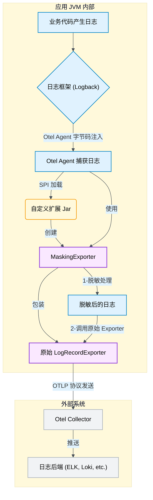
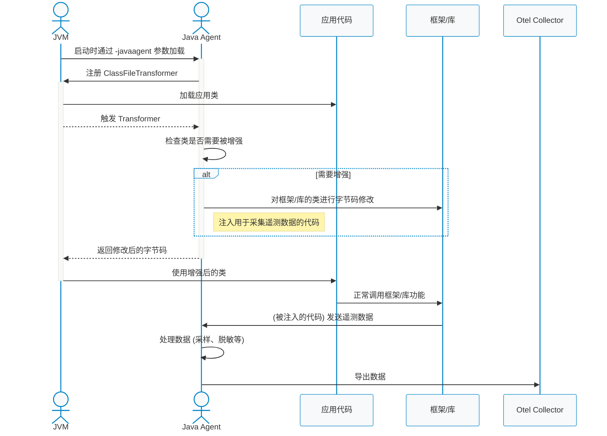

# OpenTelemetry 简介

[OpenTelemetry (Otel)](https://opentelemetry.io/) 是一个开源的、厂商中立的可观测性框架，旨在统一指标（Metrics）、日志（Logs）、链路追踪（Tracing）等遥测数据的采集、处理和导出标准。

> 其官网是这样介绍自己的：
> OpenTelemetry is an observability framework and toolkit designed to facilitate the generation, export, and collection of telemetry data such as traces, metrics, and logs. It is open source, vendor- and tool-agnostic, meaning that it can be used with a broad variety of observability backends, including open source tools like Jaeger and Prometheus, as well as commercial offerings. OpenTelemetry is not an observability backend itself.

简单来说，Otel 是一套“可观测性领域的普通话”，它定义了数据应该如何说（标准），但不管数据说了之后存到哪里（后端）。

**核心优势:**

- **后端多样性**：数据可输出至 Prometheus、Loki、Jaeger 等任意支持 OTLP (OpenTelemetry Protocol) 的后端。
- **强大的扩展性**：Collector 支持自定义处理器（Processor），可以轻松实现数据过滤、富化等复杂需求。
- **云原生集成**：天然适配 Kubernetes、Istio 等现代云原生环境，其提供的 Operator 大大简化了部署和管理。

# 背景：当 Otel 遇上日志脱敏

在引入 OpenTelemetry 之前，我的项目已经有了一套日志脱敏方案：通过扩展 Logback 的 `ClassicConverter`，在日志写入磁盘前对敏感信息（如手机号、身份证号）进行处理。随后，Filebeat 会采集这些已脱敏的日志文件并推送到 ELK Stack。

然而，当我引入 [OpenTelemetry Operator](https://github.com/open-telemetry/opentelemetry-operator) 来替代原有的 SkyWalking 方案后，问题出现了。Otel Java Agent 并非通过采集日志文件工作，而是通过字节码注入技术，在日志框架的更上游直接捕获日志内容。这导致 Otel Collector 收集到的日志是未经脱敏的原始日志，使我的脱敏机制形同虚设。

为了解决这个问题，我需要找到一种方法，让 Otel “看到”的也是脱敏后的日志。

# 案例一：通过 SPI 扩展实现日志脱敏

由于 Otel Agent 的工作方式，我必须在 Otel 的处理流程中插入脱敏逻辑。经过一番探索，我评估了四种可能的方案：

1.  **~~代理 Otel Logger~~**：尝试通过 `Delegating Appender` 代理 Otel 的 Logger，但测试后发现此路不通。
2.  **~~Logback TurboFilter~~**：在 Logback 的 `TurboFilter` 层进行拦截。这是非常底层的过滤器，性能敏感，且无法直接修改 `message` 内容，只能处理 `args`。对于对象类型的参数，脱敏处理非常棘手，引入反射会带来性能隐患。
3.  **手动调用脱敏工具类**：提供一个 `UnifiedDesensitizer` 工具类，由业务代码在打印日志时手动调用，如 `log.info("用户手机号 {}", UnifiedDesensitizer.desensitize(user.getPhone()));`。这种方式侵入性太强，改造成本高，且容易遗漏，治标不治本。
4.  **OpenTelemetry SPI 扩展**：这似乎是“正道”。利用 Otel 提供的 SPI (Service Provider Interface) 机制，为 Java Agent 编写一个自定义插件。这种方式与业务代码完全解耦，逻辑内聚，是理想的解决方案。

最终，我选择了第四种方案。实现一个自定义的日志导出器（Exporter）非常直接。

下图展示了通过 SPI 扩展实现日志脱敏的整体流程：



### 步骤 1: 创建一个代理 Exporter

我创建一个 `MaskingExporter`，它包装了原始的 `LogRecordExporter`。在 `export` 方法中，我先对日志记录进行脱敏，然后再交给原始的 Exporter 处理。

```java
import io.opentelemetry.sdk.common.CompletableResultCode;
import io.opentelemetry.sdk.logs.data.LogRecordData;
import io.opentelemetry.sdk.logs.export.LogRecordExporter;

import java.util.Collection;
import java.util.List;
import java.util.stream.Collectors;

public class MaskingExporter implements LogRecordExporter {

    private final LogRecordExporter delegate;

    public MaskingExporter(LogRecordExporter delegate) {
        this.delegate = delegate;
    }

    @Override
    public CompletableResultCode export(Collection<LogRecordData> collection) {
        List<LogRecordData> collect = collection.stream().map(this::mask).collect(Collectors.toList());
        return delegate.export(collect);
    }

    private LogRecordData mask(LogRecordData logRecordData) {
        String originalBody = logRecordData.getBody().asString();
        String maskedBody = UnifiedDesensitizer.desensitize(originalBody);
        if (originalBody.equals(maskedBody)) {
            return logRecordData;
        } else {
            // LogRecordData 是不可变对象，需要创建 Wrapper 来替换 Body
            return new LogRecordDataWrapper(logRecordData, maskedBody);
        }
    }

    // flush() 和 shutdown() 方法直接委托给原始 delegate
    @Override
    public CompletableResultCode flush() {
        return delegate.flush();
    }

    @Override
    public CompletableResultCode shutdown() {
        return delegate.shutdown();
    }
}
```

### 步骤 2: 实现 LogRecordData 的包装类

由于 `LogRecordData` 是不可变（Immutable）的，我无法直接修改其 `Body`。因此，需要创建一个 `LogRecordDataWrapper` 来持有新的 `Body`，同时代理其他所有方法的调用。

```java
import io.opentelemetry.api.common.Attributes;
import io.opentelemetry.api.logs.Severity;
import io.opentelemetry.api.trace.SpanContext;
import io.opentelemetry.sdk.common.InstrumentationScopeInfo;
import io.opentelemetry.sdk.logs.data.Body;
import io.opentelemetry.sdk.logs.data.LogRecordData;
import io.opentelemetry.sdk.resources.Resource;

// LogRecordDataWrapper 实现了 LogRecordData 接口
public class LogRecordDataWrapper implements LogRecordData {
    private final LogRecordData delegate;
    private final Body body;

    public LogRecordDataWrapper(LogRecordData delegate, String maskString) {
        this.delegate = delegate;
        this.body = Body.string(maskString);
    }

    @Override
    public Body getBody() {
        return body;
    }

    // 其他所有 getter 方法都直接调用原始的 delegate
    @Override
    public Resource getResource() { return delegate.getResource(); }
    // ... 省略其他代理方法
}
```

### 步骤 3: 通过 SPI 注册自定义 Exporter

最后，我通过 `AutoConfigurationCustomizerProvider` 这个 SPI 接口，将我的 `MaskingExporter` 注入到 Otel 的自动配置流程中。

```java
import io.opentelemetry.sdk.autoconfigure.spi.AutoConfigurationCustomizer;
import io.opentelemetry.sdk.autoconfigure.spi.AutoConfigurationCustomizerProvider;
import io.opentelemetry.sdk.logs.export.LogRecordExporter;

public class DesensitizeCustomizerProvider implements AutoConfigurationCustomizerProvider {
    @Override
    public void customize(AutoConfigurationCustomizer customizer) {
        customizer.addLogRecordExporterCustomizer(
            (logRecordExporter, configProperties) -> new MaskingExporter(logRecordExporter)
        );
    }
}
```

并在 `META-INF/services/io.opentelemetry.sdk.autoconfigure.spi.AutoConfigurationCustomizerProvider` 文件中声明我的实现类。

### 步骤 4: 打包和部署

将上述代码打包成一个 JAR 文件（例如 `open-telemetry-mask-1.0.0.jar`），然后在应用启动时通过 `-Dotel.javaagent.extensions` 参数加载它。

```bash
-Dotel.javaagent.extensions=/path/to/open-telemetry-mask-1.0.0.jar
```

至此，日志脱敏功能完美集成，且对业务代码零侵入。

# 案例二：Spring Gateway 链路追踪采坑记

第二个问题更加棘手。在我的 Spring Cloud Gateway 服务中，接入 Otel Agent 后发现 `traceId` 无法在网关和下游服务之间正确传递，导致请求链路在网关处断裂。

### 初步排查：本地与测试环境的“玄学”差异

诡异的是，这个问题只在部署到测试环境后出现，本地开发环境一切正常。

- **怀疑环境差异**：通过开启 Agent 的 Debug 日志 (`-Dotel.javaagent.debug=true`)，发现本地使用的是 `NIO` 线程，而测试环境（容器化）使用的是 `Epoll` 线程。难道是操作系统或 Netty 的实现差异导致？沿着这个方向排查，最终走进了死胡同。
- **尝试本地复现**：为了方便调试，我编写了 Dockerfile 在本地构建了一个与测试环境一致的镜像。成功复现问题！但接下来，无论是远程调试（Remote Debug）还是加断点，都发现很多关键代码无法进入，猜测是字节码增强（ByteBuddy）导致断点失效。

### 柳暗花明：一行关键的日志

在反复比对本地和测试环境的 debug 日志后，终于发现了一条关键线索。在**未生效**的测试环境日志中，有这样一行：

```
[otel.javaagent] DEBUG i.o.j.e.i.InstrumentationModule - Instrumentation reactor-netty is disabled
```

而在**生效**的本地环境日志中，这行日志并不存在。`reactor-netty` 模块被禁用了！这显然是问题的核心。Otel 通过不同的 `InstrumentationModule` 来适配各种框架，`reactor-netty` 正是适配 Spring WebFlux 和 Gateway 的关键模块。

### 追根溯源：配置的优先级陷阱

为什么模块会被禁用？Otel Agent 的配置加载有明确的优先级：

| 优先级 | 配置方式                                                     |
| :------- | :----------------------------------------------------------- |
| **高**   | 1. 环境变量 (e.g., `OTEL_INSTRUMENTATION_REACTOR_NETTY_ENABLED=false`) |
| **高**   | 2. Java 系统属性 (e.g., `-Dotel.instrumentation.reactor-netty.enabled=false`) |
| **低**   | 3. Agent JAR 包内的默认配置 (`default.properties`)           |

`InstrumentationModule` 的 `defaultEnabled` 方法决定了模块是否默认开启，其默认值为 `true`。

```java
public boolean defaultEnabled(ConfigProperties config) {
  return config.getBoolean("otel.instrumentation.common.default-enabled", true);
}
```

经过仔细排查，最终在测试环境的部署配置中发现了一个“元凶”：

`ENV OTEL_INSTRUMENTATION_COMMON_DEFAULT_ENABLED="false"`

这个配置将所有非明确开启的模块都默认禁用了！而在本地调试时，我并没有设置这个全局变量，因此 `reactor-netty` 模块是默认开启的。

**解决方案**：在测试环境的配置中，显式地开启 `reactor-netty` 和其他相关模块。

```
ENV OTEL_INSTRUMENTATION_REACTOR_NETTY_ENABLED="true"
ENV OTEL_INSTRUMENTATION_SPRING_WEBFLUX_ENABLED="true"
ENV OTEL_INSTRUMENTATION_SPRING_CLOUD_GATEWAY_ENABLED="true"
```

添加配置后，`traceId` 成功透传，链路恢复完整。

# OpenTelemetry Agent 加载原理解析

在深入探讨具体案例之前，我们有必要先理解 OpenTelemetry Java Agent 的核心工作机制。Agent 的能力主要源于 Java 的 `java.lang.instrument` 包和字节码操作技术（如 ByteBuddy）。

其加载和工作的流程大致如下：



**核心流程解读：**

1.  **Agent 加载**：JVM 在启动时通过 `-javaagent` 参数指定 Agent JAR 包。这是 Java 提供的标准机制，允许代理在应用程序的 `main` 方法执行之前介入。
2.  **注册转换器**：Agent 的 `premain` 方法会被调用，它会向 JVM 注册一个 `ClassFileTransformer`。这个转换器使得 Agent 有机会在每个类文件被加载到 JVM 之前检查和修改它。
3.  **字节码增强**：当应用程序的类（或其依赖的库）被加载时，`ClassFileTransformer` 会被触发。Agent 内部包含了针对各种流行框架（如 Spring MVC, Netty, Logback）的**检测模块（Instrumentation Module）**。如果当前加载的类匹配某个模块的目标，Agent 就会使用 ByteBuddy 等工具动态地修改其字节码，插入用于数据采集的“钩子”代码。
4.  **数据采集与导出**：当应用程序运行时，这些被注入的钩子代码会被触发，从而捕获到如 HTTP 请求、数据库查询、日志事件等遥测数据。这些数据随后被 Agent 内部的 SDK 处理，并通过配置好的导出器（Exporter）发送到 OpenTelemetry Collector 或其他兼容的后端。

理解了这个机制，我们就能明白为什么 Agent 的行为会受到配置（如 `OTEL_INSTRUMENTATION_*_ENABLED`）的强烈影响，以及为什么可以通过 SPI 机制来扩展其内部处理流程（如我们案例一中的日志脱敏）。

# 总结与思考

这次 OpenTelemetry 的实践之旅，虽然踩了不少坑，但也收获颇丰。它不仅是一个工具集，更体现了云原生时代下可观测性的设计哲学：

1.  **标准化与解耦是基石**：Otel 的核心价值在于其提供了一套统一的、与厂商无关的标准（OTLP）。这使得我们可以在不修改代码的情况下，灵活切换和组合不同的可观测性后端（如从 Jaeger 切换到 Prometheus），避免了厂商锁定。

2.  **自动化注入是利器，但也需谨慎**：Java Agent 通过字节码增强实现了对应用的“无侵入”监控，极大地降低了接入成本。但这种“黑盒”操作也带来了新的挑战。当出现问题时（如案例二的链路中断），排查变得更加困难，需要开发者对 Agent 的工作原理和配置有更深入的理解。

3.  **扩展性是生命力**：任何一个标准都无法覆盖所有场景。Otel 通过强大的 SPI 机制，允许开发者像搭乐高一样，将自定义的功能（如日志脱敏、动态采样）无缝集成到 Agent 的数据处理流水线中。这保证了框架的灵活性和生命力，使其能够适应各种复杂的业务需求。

4.  **配置管理是关键**：从案例二的教训中我们看到，配置的优先级和默认值至关重要。一个不经意的全局配置（`OTEL_INSTRUMENTATION_COMMON_DEFAULT_ENABLED`）就可能导致“玄学”般的 Bug。因此，在生产环境中，必须建立清晰、规范的配置管理策略，并充分理解每个配置项的含义和影响。

总而言之，成功落地 OpenTelemetry 不仅仅是引入一个工具，更是对团队技术能力的一次全面考验。它要求我们不仅要知其然（会用），更要知其所以然（懂原理），才能在面对复杂问题时游刃有余，真正发挥出其在云原生可观测性领域的强大威力。 